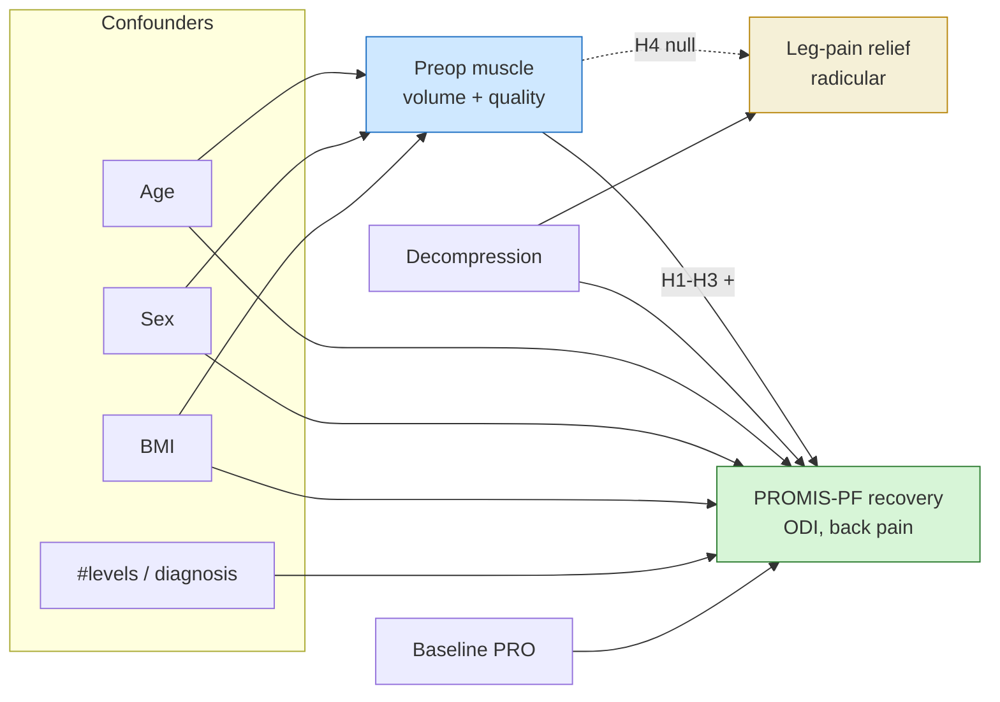
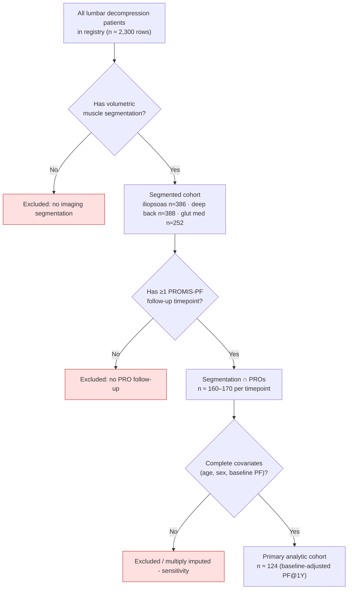
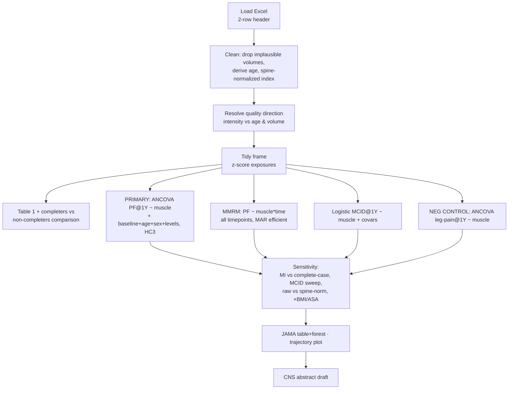
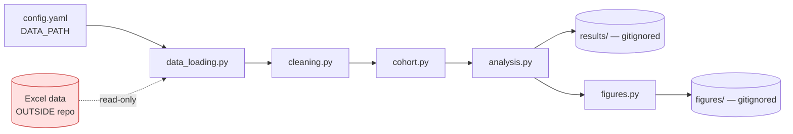

# Study & Analysis Plan
**Working title:** *Iliopsoas and paraspinal muscle volume and quality predict physical-function recovery — but not leg-pain relief — after lumbar decompression*

**Target:** CNS abstract (300 words) → full manuscript (STROBE).
**Design:** Retrospective, single-cohort, observational. Imaging (CT/MRI volumetric segmentation) + longitudinal PROs.
**Status:** PLANNING. No analysis run yet.

---

## 1. Research question & hypotheses

**Question.** In patients undergoing lumbar decompression, does preoperative
volumetric muscle morphology (iliopsoas, deep back, gluteus medius) — both *size*
(volume) and *quality* (intensity) — predict patient-reported functional recovery?

| ID | Hypothesis | Outcome | Model |
|----|-----------|---------|-------|
| **H1** (primary) | Greater preop muscle volume & quality → greater improvement in PROMIS-PF at 1Y | ΔPROMIS-PF (baseline→1Y) | Linear, baseline-adjusted |
| **H2** | Same association at the early 6-week timepoint | ΔPROMIS-PF (baseline→6W) | Linear, baseline-adjusted |
| **H3** | Better muscle → higher odds of achieving MCID on PROMIS-PF | MCID achieved (yes/no) @1Y | Logistic |
| **H4** (negative control) | Muscle metrics do **NOT** predict leg-pain improvement (radicular, decompression-driven) | ΔLeg-pain NRS @1Y | Linear, baseline-adjusted |

**The story:** muscle health gates *functional* recovery (H1–H3) that decompression
alone cannot deliver, but is irrelevant to *radicular leg pain* (H4) — the surgical
target. The H4 dissociation is the mechanistic differentiator and guards against the
"sicker-patient" confound (a global frailty marker would degrade *all* outcomes equally).

---

## 2. Conceptual model (causal DAG)

---

## 3. Study population & patient flow (STROBE)

**Realistic N ≈ 120–170.** Adequate for a multivariable model with ~4–5 covariates
(rule of thumb ≥10 events/observations per predictor). Gluteus maximus (n≈60) is
**dropped** for insufficient segmentation coverage.

---

## 4. Variables

### Exposures (per-muscle, bilateral L+R summed)
- **Volume:** `Volume ( LM) cm3` — total muscle volume.
- **Quality:** `mean` intensity within the muscle mask (fat-infiltration proxy).
- **Spine-normalized volume index:** muscle volume ÷ vertebral-body volume
  (leverages the unique vertebra/disc segmentation; dimensionless sarcopenia index).
- Each exposure **z-scored within cohort** → effects reported **per 1 SD**
  (sidesteps unclear intensity units; see §7).

### Outcomes (baseline + 6W, 1Y; secondary 3M/6M/2Y)
- **Primary:** PROMIS Physical Function (T-score).
- **Secondary:** ODI; Back-pain NRS; PROMIS Pain Interference.
- **Negative control:** Leg-pain NRS.
- Modeled by **ANCOVA** (1Y score adjusted for baseline — preferred over change
  scores) and as **MCID achieved** (binary).

### Covariates (a priori, from DAG)
Primary model: **age, sex, and baseline value of the outcome** (all near-complete in the
analytic cohort). **BMI and number of levels are excluded from the primary model**:
weight/height are corrupted (mixed g/kg and cm/m/mm units, extreme outliers), and
`num_level` is recorded for only ~37 of the segmentation∩1Y-PF patients, so forcing
either in collapses N from ~124 to ~37. The spine-normalized exposure already adjusts
for body size. Both enter sensitivity models (in the subset, or after imputation) only;
further sensitivity: + ASA, diabetes, diagnosis, approach.

---

## 5. Statistical analysis plan

- **Primary model:** **ANCOVA** — PROMIS-PF at 1Y regressed on the muscle exposure +
  baseline PF + age + sex + number of levels; HC3 robust SE; effect per 1 SD with 95% CI.
- **Efficiency/robustness:** **linear mixed model (MMRM)** over all timepoints
  (random intercept per patient; muscle × time interaction), using maximum likelihood to
  retain all patients with ≥1 follow-up under MAR — addresses the ~50% 1Y attrition and
  yields the recovery-trajectory figure.
- **MCID:** logistic regression for attainment at 1Y; PROMIS-PF threshold ≈ 4.5 (sweep
  3.0–8.0); ODI ≈ 12.8-point / 30% change.
- **Negative control (H4):** identical ANCOVA on leg-pain NRS; a non-null effect here
  would signal residual (frailty) confounding rather than a specific functional pathway.
- **Exposures:** per-muscle spine-normalized volume and relative quality (z-scored);
  **prespecified primary = iliopsoas volume**; a composite paraspinal z-score
  (mean of the three muscles) as a power-boosting secondary. Other muscle/outcome/
  timepoint combinations are exploratory, reported with CIs, not p-thresholded.
- **Quality direction** is resolved empirically (intensity vs age and vs volume) before
  interpretation, then labelled "relative attenuation/quality" given non-Hounsfield units.
- **Missing data:** MMRM (MAR) is primary for efficiency; complete-case ANCOVA as the
  interpretable headline; multiple imputation as sensitivity; completers vs
  non-completers compared on baseline characteristics.
- **Software:** Python (pandas, statsmodels). Fully scripted & reproducible.

---

## 6. Code architecture

Each module is import-safe and CLI-runnable. No hard-coded paths; everything via `config.yaml`.

---

## 7. Data-quality issues & handling
1. **Volume outliers** (iliopsoas max 170,583 cm³ vs median 88) → winsorize top 1% +
   flag physiologically implausible values; sensitivity analysis excluding them.
2. **Intensity units unclear** (range 10–953, no negatives → not CT Hounsfield;
   likely MRI signal) → never interpret as absolute HU; use **z-scored** values and/or
   **ratio to a reference tissue**; report as "relative muscle quality."
3. **Two volume methods** (LM vs sv) → use LM primary, report agreement as QC.
4. **Laterality** → sum L+R primary; explore L–R asymmetry as exploratory only.

---

## 8. Novelty positioning
See `docs/LITERATURE_REVIEW.md`. The field (paraspinal sarcopenia → spine-surgery PROs)
is active, so novelty is **incremental but defensible**, resting on the combination of:
(a) **iliopsoas + multi-muscle volumetric 3D** segmentation (vs single-slice CSA);
(b) **decompression-only** cohort with **PROMIS-PF + MCID**; (c) the **leg-pain
negative-control dissociation**; (d) a **spine-normalized** index.

---

## 9. Deliverables & sequence
1. ✅ Literature/novelty review
2. ✅ This plan + repo scaffold + mermaid diagrams
3. ✅ Study-design schematic (`docs/study_design_schematic.*`) + call graph + code walkthrough
4. ⬜ Implement `src/` modules
5. ⬜ Run analysis → Table 1, models, figures
6. ⬜ Draft 300-word CNS abstract (Intro / Objective / Methods / Results / Conclusion)
7. ⬜ (Optional) interactive results dashboard

---

## 10. Limitations (anticipated, for abstract/manuscript honesty)
- Retrospective, single-cohort; associations ≠ causation.
- Moderate N (~120–170); secondary outcomes underpowered.
- Imaging modality/intensity units require careful normalization.
- Loss to follow-up at 1Y (selection bias) → compare completers vs non-completers.
- Segmentation extent may differ from anatomical totals (relative comparison valid).
